# CASA0018-Banana-Ripeness-Detection
Author: Haoming Wang (Axe)  
https://www.youtube.com/watch?v=7h5FKB_-l3k (YouTube)  
https://studio.edgeimpulse.com/studio/363527 (Edge-Impulse project page)  
https://github.com/whmfmvp/CASA0018-Banana-Ripeness-Detection (GitHub Repo)  

**Introduction**  
This project aims to develop a banana ripeness detection system based on deep learning for sensor networks. Through this system, users can quickly and accurately judge the ripeness of bananas, which is divided into three stages: Underripe, Ripe, and Overripe. This system is trained on the Edge Impulse platform and uses a large amount of banana image data from different maturity stages to ensure the accuracy of the model. This model is deployed on the mobile phone and implements a portable and practical banana ripeness detection tool.  

The inspiration comes from a common problem in daily life: how to accurately determine the ripeness of fruits. Most people judge whether fruits are ripe by observing their appearance, color, hardness, or smell, which is not only time-consuming and laborious but also has limited accuracy. Accurate judgment of maturity is particularly important, especially for fruits like bananas that are prone to spoilage.  

Adhi Harmoko Saputro(2018) states that the change in the banana's skin color from green to yellow, which signals the banana's maturity, is due to the breakdown of chlorophyll pigment. The real-time classification of bananas using an image processing tool in MATLAB, which employs the RGB color detection technique, is a non-destructive, quick, reliable, and effective process for categorizing bananas (Maithilee Nagesh Kulkarni and Rohini Mudhalwadkar, 2017). A simple algorithm using the CNN model is proposed to determine the ripeness color of fruit, specifically bananas, which can enhance the efficiency for cashiers and customers at counters by simplifying the process of determining fruit and vegetable prices, potentially replacing the conventional weighing method and saving time(Priyanka et al., n.d., 2020).  

**Research Question**  
How to develop an accurate and efficient real-time banana ripeness detection system using deep learning technology and IoT devices?  

**Application Overview**  
This project contains three main parts. First of all, take photos of bananas in different maturity stages and find some pictures online to form banana datasets. Secondly, import datasets in Edge Impulse and choose the best deep learning model by conducting 63 experiments by changing parameters, such as learning block, model chosen, learning rate, dropout rate, batch size, data augmentation and epochs. Lastly, export the code and deploy it on a mobile phone to detect whether the banana is underripe, ripe or overripe.  
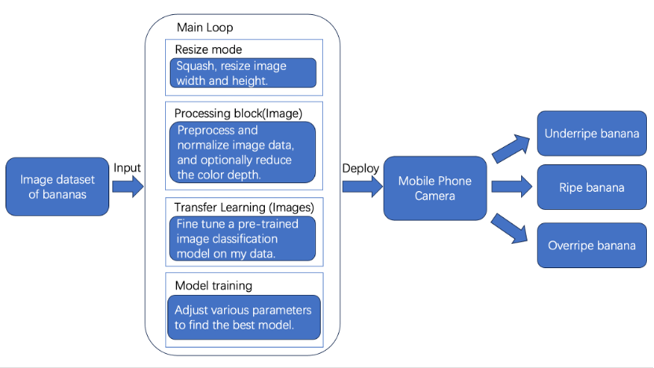  
Figure 1. Application diagram of the building blocks of the banana ripeness detection  

**Data**  
Data source  
I went to the supermarket to buy some bananas and took photos of them at different times of purchase and storage to obtain a dataset of underripe, ripe, and overripe bananas. In addition, I collected banana images from different maturity stages online to enrich the dataset and enable the model to receive sufficient training.  

Datasets  
The total number of collected data is 1,189 images, divided into three different labels(Underripe, Ripe and Overripe). Among them, 80 percent images are used for model training and the remaining 20 percent are used for model testing. In addition, 20 percent training images are used for validation, so total ratio of training, validation and testing is 60:20:20.  

|Classification|Training|Testing|Total|
|---------|--------|-------|--------|
|Underripe|325|82|407|
|Ripe|283|68|351|
|Overripe|348|83|431|
|Total|956|233|1189|  

Table 1. Datasets description  

Data pre-processing
The original images have different sizes, I resize all images with 96 width and 96 height in order to unify the banana datasets. Besides, I use “fit shortest axis” and “squash” two different resize modes to test which one has better accuracy performance.  

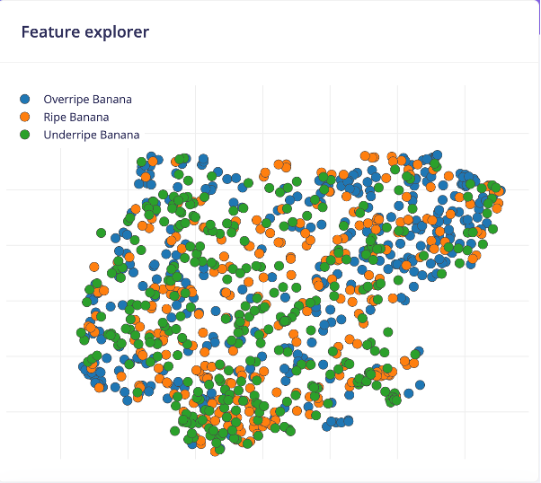  
Figure 2. Feature explorer of three ripeness types of banana dataset  

  
Figure 3. Create impulse interface  

**Model**  
After collecting data, it will be sent to the processing and learning stages for feature generation and machine learning. Then, different parameter settings can be used to train the model, followed by testing and deployment.  
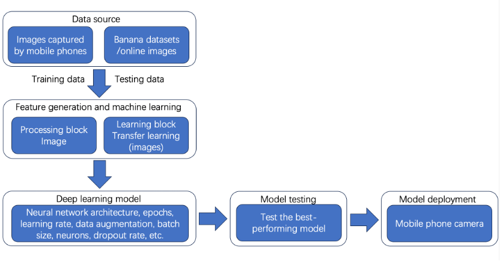  
Figure 4. The complete workflow of the model  

For the learning block, I tried two types of methods, classifier and transfer learning. In the first 8 experiments, I found that although the classifier method had better validation accuracy but it performed worse on testing accuracy so I gave it up for more experiments.  
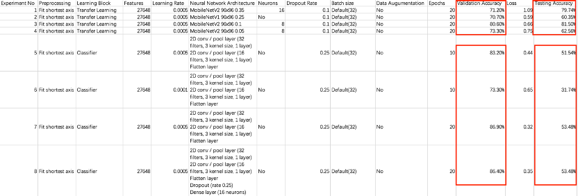  
Figure 5. Experiments of testing learning block  

After determining the use of transfer learning methods, I did several experiments to find the best neural network architecture model. Sandler, M. et al. (2018) stated that MobileNetV2 builds on the simplicity of MobileNetV1, avoiding special operators and significantly enhancing accuracy without complicating its design.   
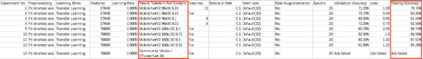  
Figure 6. Experiments of testing neural network architecture  

After trying several experiments, I finally decided to use the MobileNetV2 model because it has better testing accuracy compare with MobileNetV1.  

**Experiments**  
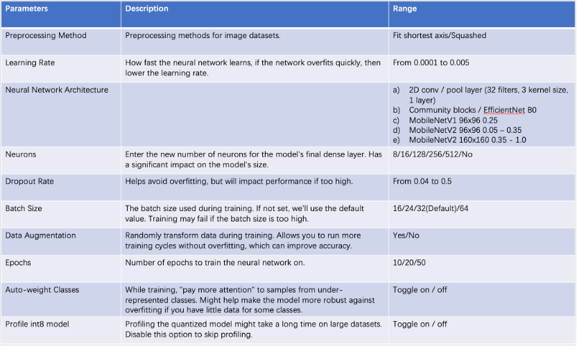   
Table 2. Parameters changes made during experiments  

Overall, I took 64 experiments to find the best model with the highest testing accuracy, by changing a variety of parameters which may affect the performance of the model.  
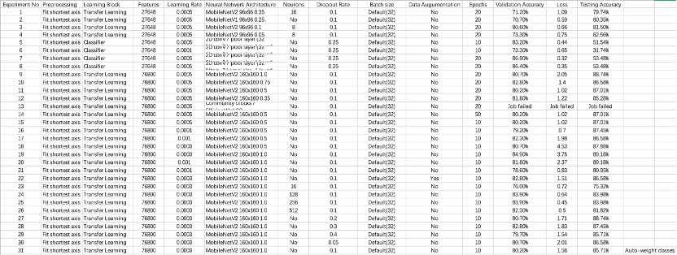  
Figure 7. Experiments of fit shortest axis pre-processing method  

In experiments 1 - 31, I performed Fit shortest axis processing on the image dataset and then tested the impact of other parameters on model performance. Experiments 1-8 determined transfer learning has better performance than classifier in this case; experiments 9-13 tested MobileNetV2 160x160 0.5 is optimal for neural network architecture; experiments 14 and 15 discovered increasing epochs would not enhance the testing accuracy for the model but increasing model training time; experiments 16 - 21 tested which range of learning rate is good for raising model performance; experiment 22 assured data augmentation should be disabled; experiments 23 -26 reflected it is better not to set neurons for the final dense layer; experiments 27 – 31 measured the best dropout range and whether toggle on auto-weight classes.  
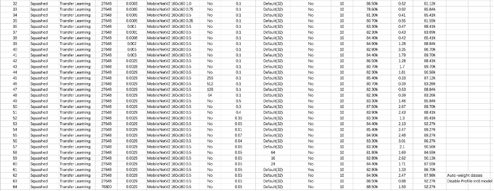  
Figure 8. Experiments of squashed pre-processing method  

After conducting the first 31 experiments, the testing accuracy of the model did not exceed 90%. To elevate accuracy, I speculate that using the squash method in the image dataset preprocessing stage may have better performance, so I conducted 32 - 64 experiments. Experiments 32 – 35 retested which model is better for neural network architecture; experiments 36 – 44 were assured when the learning rate was 0.0029 model had the highest testing accuracy; experiments 45 -48 verified did not set neurons for the final dense layer; experiments 49 – 57 found it is better to set dropout rate at 0.05; experiments 58 – 60 discovered default batch size is optimal which is 32; experiment 61 verified again that data augmentation should be disabled; experiments 62 and 63 defined auto-weight classes and profile int8 model should be disabled as well; experiment 64 tested 96*96 pixels images have same performance with this model but have lower loss compared with 160*160 pixels images.  

**Results and Observations**  
Results  
The optimal model with the highest testing accuracy has been determined, the parameters are listed below:  
Preprocessing Method: Squashed  
Learning Block: Transfer Learning  
Learning Rate: 0.0029  
Neural Network Architecture: MobileNetV2 160x160 0.5  
Neurons: No  
Dropout Rate: 0.05  
Batch Size: 32  
Data Augmentation: No  
Epochs: 10  
Auto-weight Classes: No  
Profile int8 model: No  
Accuracy on validation set: 88.50%  
Loss: 0.88  
Accuracy on testing set: 92.27%  

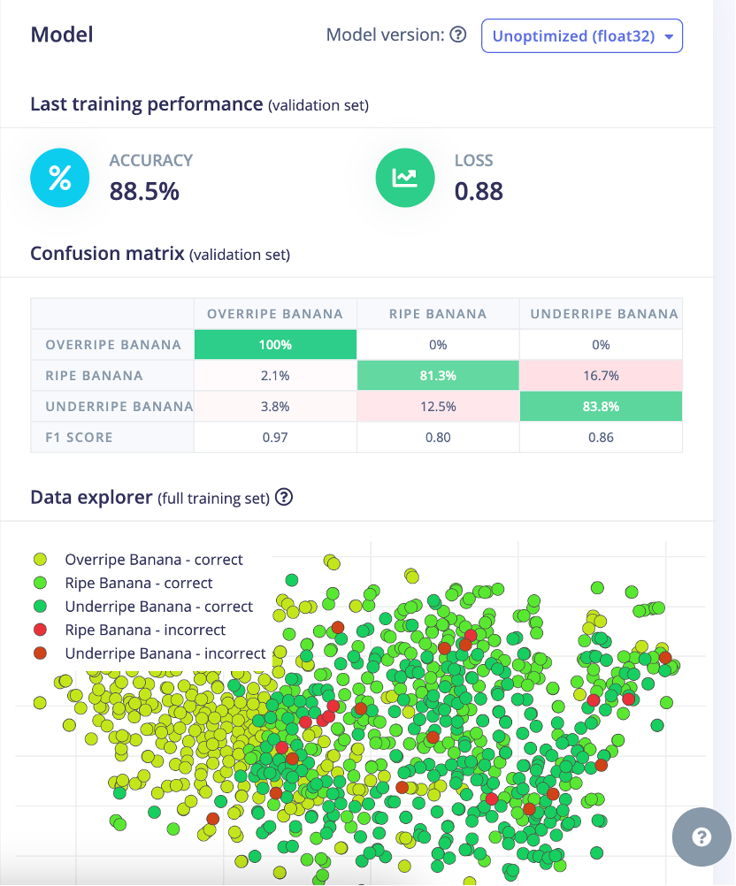  
Figure 9. Validation accuracy and loss of optimal model  

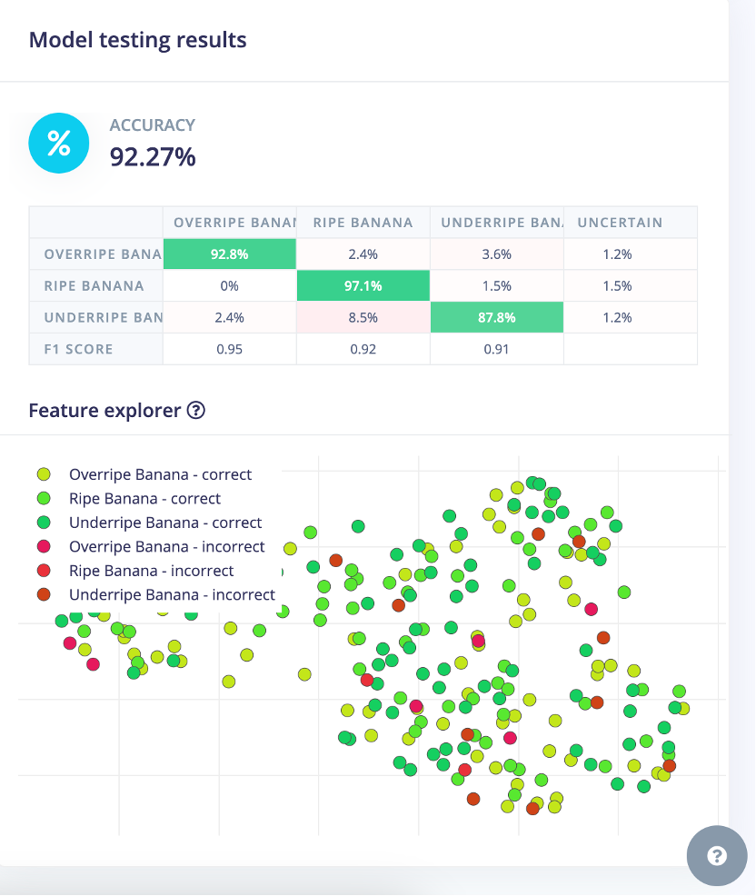  
Figure 10. Testing accuracy of optimal model  

Observations  
1. Increasing the epochs of the training model did not improve the accuracy of the model  
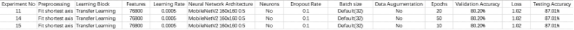  
Figure 11. Experiments of testing epochs  
From experiments 11, 14 and 15 I found that the performance of the model did not improve as epochs increased, this means the model has learned all the useful information it is capable of learning so it may have reached its performance limit at an earlier training stage.  

2. No final dense layer model has better performance  
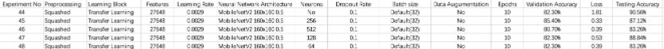  
Figure 12. Experiments of testing final dense layer neurons  
Models without a final dense layer typically have fewer parameters, thereby reducing the risk of overfitting. Removing a final dense layer can make the model more dependent on the features learned from convolutional layers, which are usually more universal and robust.  

3. Default batch size(32) has the best performance  
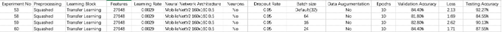  
Figure 13. Experiments of testing batch size  
When the batch size is 32, the model performs best, indicating that this size may provide a balanced gradient estimation accuracy and noise level for my model and dataset. When changing the batch size, the decrease in accuracy may be due to the stability and generalization ability of the model training being affected.  

4. Data augmentation can increase validation accuracy but may decrease testing accuracy  
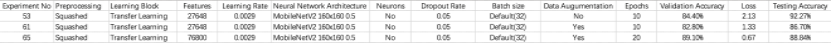  
Figure 14. Experiments of testing data augmentation  
Experiment 61 uses the data augmentation method but does not increase epochs so the model may not be sufficiently trained. Experiment 65 increases epochs from 10 to 20, and the validation accuracy has indeed improved, but it may cause over-fitting so it doesn’t perform well on the testing dataset.  

5. Downsides of using a mobile phone instead of a microcontroller  
At first, I wanted to deploy the trained model to the Arduino Nano 33 BLE Sense with OV7675 camera module, but when I uploaded the code, it showed that the microcontroller was out of memory. Therefore, I deployed it on my phone for model testing. However, this method has several limitations. Firstly, when a certain type of banana is detected, there is no reminder except that it will be displayed on the phone screen. In addition, using a mobile phone will quickly consume a mobile phone battery since it is more energy-consuming than using a microcontroller. Last but not least, a mobile phone is much more expensive than Arduino Nano 33 BLE Sense with OV7675 camera module.  

Future development  
1. Improving the performance and adaptability of the model, to make it can be deployed on the microcontroller and higher testing accuracy.  
2. Introducing more types of fruits to detect whether they decay.  
3. More circuit components can be added to indicate if certain ripeness types of bananas are detected, such as an LED flash or a buzzer alert to build a more comprehensive system.  
(Word count: 1637)  

**Bibliography**  
1. Adhi Harmoko Saputro, Syifa Dzulhijjah Juansyah and Windri Handayani (2018). Banana (Musa sp.) maturity prediction system based on chlorophyll content using visible-NIR imaging. Doi: https://doi.org/10.1109/icsigsys.2018.8373569.  
2. Maithilee Nagesh Kulkarni and Rohini Mudhalwadkar (2017). Data driven modelling for banana ripeness assessment. Doi: https://doi.org/10.1109/iccons.2017.8250545.  
3. Priyanka, C., Shikha Rachel, V., Harshith, B. and Moulisha, R. (n.d.). Color Recognition Algorithm using a Neural Network Model in Determining the Ripeness of a Banana. [online] Available at: https://jespublication.com/upload/2020-1106123.pdf.  
4. Sandler, M. et al. (2018) “MobileNetV2: Inverted Residuals and Linear Bottlenecks,” in 2018 IEEE/CVF Conference on Computer Vision and Pattern Recognition. [Online]. 2018 IEEE. pp. 4510–4520.  
‌
**Declaration of Authorship**  
I, Haoming Wang, confirm that the work presented in this assessment is my own. Where information has been derived from other sources, I confirm that this has been indicated in the work.  
Haoming Wang  
2024.04.17  

